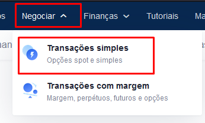

# BSC para OkEx

Para se utilizar a rede da OkEx, é necessario ter OKT na carteira para o pagamento das taxas.

Os métodos abaixo partem do principio que vc já conhece o basico de crypto moedas e como transaciona-las

## Método 1

1. Acesse sua conta na [binance.com](https://accounts.binance.com/pt-BR/register?ref=212815122)
2. Na binance você deve comprar USDT (USDT é uma stable coin)&#x20;
3. Com o USDT comprado, você deve acessar sua conta na OkeX. Caso ainda nao tenha um cadastro acesso o link: [https://www.okex.com/](https://www.okex.com/join/10450734)
4. Conectado em sua conta da OkEx, você deve acessar a área para depositos, selecionar a moeda USDT e rede USDT-TRC20 conforme a imagem abaixo:.png>)
5. Na sequencia clique em "Continuar" Você estara em uma tela como a abaixo. Note que nela vc tem o seu endereço USDT este será o endereço que você utilizara para enviar os recursos da Binance para a OkEx, ainda nesta tela troque o campo "Depositar em" para "Trading Account" isso economizará alguns cliques. .png>)
6. Agora volte na Binance, Acesse a sessão de Fiat e Spot, localiza o token USDT e clique em sacar: .png>)
7. Agora na tela de saque, tenha muita atenção com os dados que vc vai colocar. No campo endereço você deve colocar o "endereço USDT" que você pegou no passo 5, no campo rede vc deve selecionar "TRX Tron (TRC20). .png>)
8. Após converir bem os dados acima e ter certeza de que o seu endereço e arede estão corretos, você deve clicar em Sacar e realizar as confirmações da binance.
9. Após a confirmação da sua transação você recebera os seus tokens na sua conta da [https://www.okex.com/](https://www.okex.com/join/10450734)
10. Com seus tokens USDT na OkEx agora você precisa converter eles para OKT para poder utilizar a rede a OkEx Chain. Para converter o token acesse o menu "Negociar" na sequencia "Transações simples" 
11. Caso na proxima tela não abra o par OKT/USDT, pesquise o par conforme a tela abaixo e realize a compra dos seus OKT: .png>)
12. Com seus OKT comprados retorne a pagina principal da [https://www.okex.com/](https://www.okex.com/join/10450734), acesse  o menu "Contas de Fundos", na sequecia clique em "transferir" e novamente em "Transferir": .png>)
13. Você precisa transferir os seus OKT's da conta Trading para a conta Funding, assim podera envia-los a sua metaMask. Altere o formulario conforme a imagem abaixo e clique em "confirmar" Obs. na imagem o botão esta bloqueado pq nao tenho saldo no momento do print: .png>)&#x20;
14. Agora volte ao menu "Conta de Fundos" e clique em "sacar": .png>)
15. Seleciona a moeda OKET, a rede para qual deseja sacar neste caso a rede da OkExChain e clique em continuar: .png>)
16. Na próxima tela você deve colocar o endereço da sua MetaMask, a quantidade de token e clicar em continuar: .png>)
17. Pronto após a transação ser finalizada você tera os OKT na sua metamask e podera utilizar a rede a OkExChain

